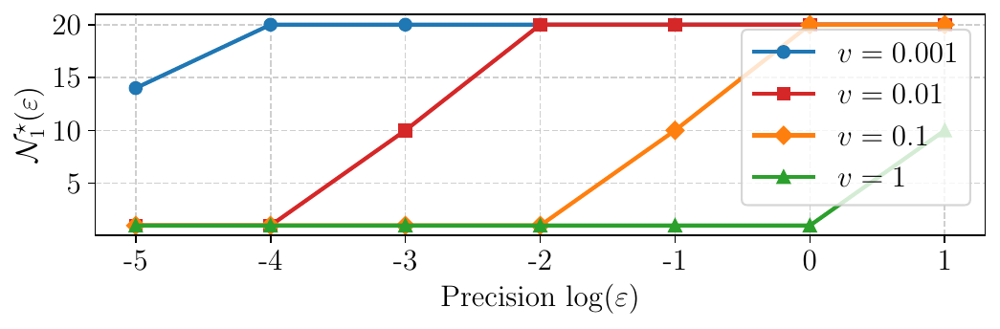

# Adaptive collaboration for online personalized distributed learning with heterogeneous clients
We present here the code of the experimental parts of the following paper:
```
Constantin Philippenko, Batiste Le Bars, Kevin Scaman and Laurent Massoulié, Adaptive collaboration for online personalized
distributed learning with heterogeneous clients, 2025.
```

We study the problem of online personalized decentralized learning with $N$ statistically heterogeneous clients 
collaborating to accelerate local training. An important challenge in this setting is to select relevant 
collaborators to reduce gradient variance while mitigating the introduced bias. To tackle this, we introduce a 
gradient-based collaboration criterion, allowing each client to dynamically select partners with similar gradients 
during the optimization process. Our criterion is motivated by a refined and more general theoretical analysis of 
the $\texttt{All-for-one}$ algorithm, proved to be optimal in Even et al. (2022) for an oracle collaboration scheme. 
We derive excess loss upper-bounds for smooth objective functions, being either strongly convex, non-convex, or 
satisfying the Polyak–Łojasiewicz condition; our analysis reveals that the algorithm acts as a variance reduction 
method where the speed-up depends on a *sufficient variance*. 
We put forward two collaboration methods instantiating the proposed general schema; and we show that one variant 
preserves the optimality of $\texttt{All-for-one}$.  We validate our results with experiments on synthetic and real 
datasets.

## Project structure.

- ```pickle```: Serialized .pkl files containing training and test accuracy/loss logs.
- ```pictures```: Automatically generated figures used in the paper.
- ```pictures_for_README```: Selected figures included in this README.
- ```runs```: TensorBoard logs for experiment monitoring.
- ```src```: Source code directory.
  - ```data```: Data preprocessing and client network generation.
  - ```optim```: Training procedures and optimization algorithms.
  - ```plot```: Scripts for generating all plots and figures.
  - ```utils```: Utility functions shared across modules.
  - ```run_experiments.py```: Entry point script to run experiments on a specified dataset.
- ```test```: Unit tests for key PyTorch functions.

## Running experiments

Run the following commands to generate the illustrative figures in the article.

### Figure 1

```python3 -m src.PlotSufficientClusters```

<p float="left">
  
</p>

### Figure 2

Epoch index on the X-axis,  logarithm of the test loss on the Y-axis.

**Left**: $d=2$. **Right**: $d=10$.

<p float="left">
  
  
</p>


```python3 -m src.run_experiments --dataset_name synth```

```python3 -m src.run_experiments --dataset_name synth_complex```

### Figure 3

Epoch index on the X-axis,  logarithm of the test loss on the Y-axis.

**Left to right**: (a) mnist, (b) cifar10, (c) heart disease and (d) ixi.

<p float="left">
  
  
  
  
</p>


```python3 -m src.run_experiments --dataset_name mnist```

```python3 -m src.run_experiments --dataset_name cifar10```

```python3 -m src.run_experiments --dataset_name heart_disease```

```python3 -m src.run_experiments --dataset_name ixi```

### Table 2

```python3 -m src.BuildAccuracyLossTable```

### Used dataset.

We use four real datasets: mnist, cifar10, heart disease and ixi that should be stored at this location ```~../DATASETS```.

Mnist and Cifar10 are automatically downloaded if their are not present. The user should download heart disease and ixi
following the instruction from the [Flamby's repository](https://github.com/owkin/FLamby)


## GPU usage

If the GPU is not find:
1. ```sudo lsof /dev/nvidia-uvm```: identify moduls that use the GPU
2. Kill them.
3. ```sudo rmmod nvidia_uvm```
4. ```sudo modprobe nvidia_uvm```
5. 
## Requirements

Using pip:
```pip install -c conda-forge -r requirements.txt python=3.11.7```. 

Or to create a conda environment: ```conda create -c conda-forge --name adaptative_collaboration --file requirements.txt python=3.11.7```.

## Maintainers

[@ConstantinPhilippenko](https://github.com/philipco)

## License

[MIT](LICENSE) © Constantin Philippenko

# References
If you use this code, please cite the following papers

```
@article{philippenko2025adaptative,
  title={Adaptive collaboration for online personalized distributed learning with heterogeneous clients},
  author={Philippenko, Constantin and Le Bars, Batiste and Scaman, Kevin and Massoulié, Laurent},
  year={2025}
}
```
